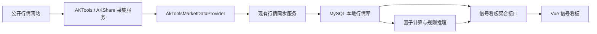
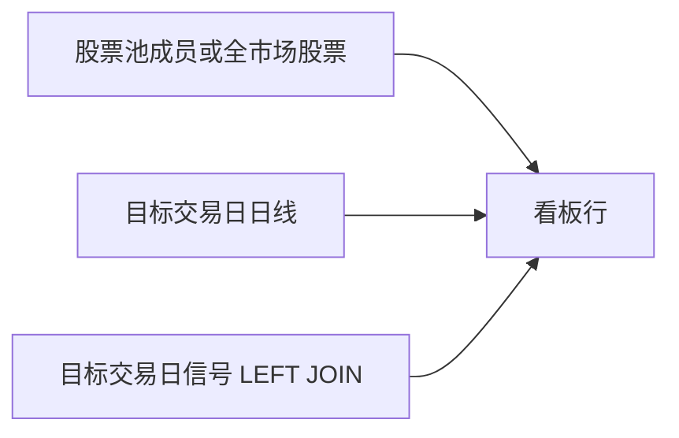

# 信号看板真实 A 股行情接入设计

## 1. 背景与目标

当前信号看板存在三个直接影响使用的问题：

1. 市场环境概览没有真实数据；
2. 添加股票时只有两只 `mock` 股票可选；
3. 股票加入股票池后，如果当日尚未生成信号，看板列表不会展示该股票。

本期目标是在不引入 Token 的前提下接入沪深京 A 股真实收盘日线，使股票池支持全量真实股票搜索，并让尚未完成因子计算和规则推理的股票以“待生成信号”状态立即展示。

系统输出继续定位为股票研究和辅助决策信号，不构成投资建议，不表达确定性预测，也不保证收益。

## 2. 范围

### 2.1 本期范围

- 仅覆盖沪深京 A 股；
- 每个交易日收盘后同步日线数据；
- 使用 AKTools/AKShare 作为免 Token 行情采集能力；
- 同步股票基础信息、行业分类、交易日历、全市场收盘快照和沪深 300 基准行情；
- 支持股票候选分页搜索和批量添加；
- 无当日正式信号的股票展示“待生成信号”；
- 外部行情失败时保留最后一次成功数据并展示延迟状态。

### 2.2 非本期范围

- 盘中实时或分钟行情；
- 港股、美股的实际采集实现；
- 全部股票多年历史行情回补；
- 新增或修改因子、规则算法；
- 收益承诺或确定性预测。

## 3. 方案选择

采用“AKTools 独立采集服务 + Java Provider 适配”方案。

AKTools 将 AKShare 能力暴露为 HTTP API，Java 后端通过内部网络访问。与 Java 直接依赖未公开的网页接口相比，该方案把易变化的采集细节隔离在采集服务中；与 BaoStock 相比，AKShare 对 A 股列表、日线、指数和行业相关数据的组合覆盖更适合本期需求。

AKShare 的上游公开数据接口可能变化，因此系统不得把它当作具备稳定 SLA 的商业行情源。实现必须包含版本固定、超时、有限重试、熔断、质量校验、本地持久化和最后成功数据兜底。

参考资料：

- [AKTools 使用说明](https://pypi.org/project/aktools/)
- [AKShare 股票数据文档](https://akshare.akfamily.xyz/data/stock/stock.html)
- [AKShare 指数数据文档](https://akshare.akfamily.xyz/data/index/index.html)
- [AKShare 项目与许可](https://github.com/akfamily/akshare)

## 4. 总体架构



架构边界如下：

- AKTools 只负责采集和返回原始数据，不直接访问业务数据库；
- Java Provider 负责字段映射、代码标准化、单位换算和错误归一化；
- 页面只读取 MySQL，不在页面请求期间直连外部行情；
- Provider 接口携带市场维度，一期只实现 A 股，后续可增加港股和美股实现；
- `mock`、`csv`、`tushare` Provider 继续保留，但测试和真实环境必须显式选择数据源；
- 真实数据源不可用时不得静默降级为 `mock`。

## 5. Provider 能力与数据模型

扩展行情 Provider，使其具备下列市场级能力：

- `fetchStockList(market)`：获取正常上市股票基础信息；
- `fetchDailySnapshot(market, tradeDate)`：获取目标交易日的全市场收盘快照；
- `fetchBenchmarkQuotes(market, startDate, endDate)`：获取市场基准指数日线；
- `fetchTradeCalendar(market, startDate, endDate)`：获取交易日历；
- `fetchIndustryMembership(market)`：获取股票与行业的对应关系。

一期市场基准为沪深 300，内部标准代码为 `000300.SH`。采集适配器负责把 AKShare/AKTools 的代码形式转换为系统现有代码格式。

股票基础信息至少包含：股票代码、名称、市场、交易所、行业、上市状态、数据源和同步时间。日线至少包含：交易日、开高低收、昨收、涨跌幅、成交量、成交额、数据源和同步时间。

## 6. 初始化与每日同步

### 6.1 初始化任务

增加异步、可审计、幂等的初始化任务入口：

```http
POST /api/market-data/sync/bootstrap
```

接口立即返回任务编号，后台依次执行：

1. 同步全部 A 股基础信息；
2. 同步行业分类；
3. 同步当年交易日历；
4. 回补沪深 300 最近至少 60 个交易日行情；
5. 同步最近交易日的全市场收盘快照。

任务进度和每一步的扫描、插入、更新、跳过、失败数量写入同步运行记录。

### 6.2 每日任务

每个交易日 `18:00 Asia/Shanghai` 执行：

1. 依据本地交易日历确认当天是否开市；
2. 更新股票基础列表；
3. 同步全市场收盘快照；
4. 同步沪深 300 日线；
5. 执行数据质量校验；
6. 校验通过后触发现有因子计算与规则推理流程。

行业分类每周更新，交易日历每月滚动同步。

### 6.3 质量校验

校验阈值通过配置管理，至少包括：

- A 股基础股票数量达到合理下限；
- 当日行情覆盖率达到正常上市股票的 `95%`；
- 股票代码、市场、交易日和价格字段合法；
- 沪深 300 存在目标交易日行情；
- 同一股票同一交易日只有一条记录；
- 外部返回空列表时同步失败，不覆盖现有数据。

数据采用幂等写入。校验失败时保留上一次成功数据，不触发后续因子和规则任务。

### 6.4 失败策略

- 网络和临时错误使用有限次数重试和指数退避；
- 连续失败后进入短期熔断，避免上游封禁本机 IP；
- 不自动回退到 `mock`；
- 单项失败记录数据源、错误原因和时间；
- 页面展示最后成功同步时间和数据延迟状态；
- 沪深 300失败不删除已有行业和个股行情，但市场环境明确显示基准行情不可用。

## 7. 股票候选搜索与批量添加

`/api/watchlists` 只返回股票池摘要和已有成员，不再把全市场股票嵌入虚拟 `all` 股票池。

新增分页候选接口：

```http
GET /api/watchlists/{poolCode}/stock-candidates
    ?market=A股
    &keyword=茅台
    &pageNum=1
    &pageSize=50
```

候选行包含 `symbol`、`name`、`market`、`exchange`、`industry` 和 `inPool`。搜索支持标准股票代码、纯数字代码和股票名称。已在目标股票池中的股票返回 `inPool=true`，前端显示“已添加”并禁止重复选择。

新增批量接口：

```http
POST /api/watchlists/{poolCode}/stocks/batch
```

```json
{
  "symbols": ["600519.SH", "300750.SZ"],
  "groupName": "核心观察"
}
```

批量操作在一个事务中完成基础校验和写入，自动去重，并返回新增、跳过和失败列表。保留现有单只添加接口，兼容已有调用方。

前端添加股票抽屉使用防抖搜索和分页加载，不一次渲染全部 A 股。

## 8. 看板查询与“待生成信号”

看板查询从“以信号表为主”改为“以当前股票池候选股票为主”，再左连接目标交易日行情和信号：



行状态定义：

- 存在正式信号：`signalStatus=ready`，展示看涨、看跌、观望或高风险；
- 不存在正式信号：`signalStatus=pending`，展示“待生成信号”；
- 存在行情但无信号：价格和涨跌幅正常展示；
- 行情也不存在：价格显示 `--`，展示“行情待同步”。

查询和分页在数据库侧完成，避免把全市场数据加载到 Java 内存后再分页。

指标语义：

- “关注股票”统计当前股票池成员总数；
- “产生信号”统计存在正式信号的股票数；
- 看涨、看跌、观望、高风险只统计正式信号；
- 信号筛选增加“待生成信号”；
- 未指定信号筛选时同时返回正式信号和待生成行。

市场环境统计口径：

- 沪深 300走势和行业强弱使用全 A 股行情口径；
- 信号情绪和风险概览使用当前股票池口径；
- 页面明确标注统计范围。

## 9. 添加后立即可见

添加成功事件返回目标股票池和新增代码：

```ts
{
  poolCode: string;
  addedSymbols: string[];
}
```

父页面收到事件后：

1. 切换到目标股票池；
2. 清除会隐藏新增股票的代码和信号筛选；
3. 回到第一页；
4. 重新查询股票池和看板；
5. 新增股票立即以“待生成信号”出现。

## 10. 部署与配置

AKTools 与 Spring Boot 使用不同端口：

- AKTools：`8090`；
- Spring Boot：`8080`；
- Vue 开发服务：沿用项目现有端口。

固定 `aktools` 和 `akshare` 版本，不使用浮动 `latest`。Java 通过环境变量读取 AKTools 地址、超时、重试和质量阈值。AKTools 只暴露在内部网络，不直接对公网开放。

真实开发和生产环境配置 `MARKET_DATA_PROVIDER=aktools`，单元测试显式配置为 `mock`。仓库中不新增 Token、账号、数据库密码或其他敏感信息。

## 11. 测试策略

### 11.1 后端

- AKTools JSON 映射、空值和单位转换；
- 沪深京股票代码标准化；
- 大响应处理、超时、重试、空数据拒绝和旧数据保留；
- 同步幂等性与质量阈值；
- 股票候选分页搜索及 `inPool` 状态；
- 批量添加事务、重复成员和市场校验；
- 无信号股票返回 `pending`；
- 同日正式信号替换 `pending` 展示；
- 沪深 300、行业强弱和信号情绪统计口径。

### 11.2 前端

- 添加抽屉使用后端分页搜索；
- 防抖、分页、已添加禁用和异常提示；
- 批量添加后切换目标股票池并刷新；
- “待生成信号”和“行情待同步”展示；
- 市场环境的正常、空数据和延迟状态；
- API 基础路径只拼接一次，避免 `/api/api/...`。

## 12. 验收标准

1. `stock_base` 中包含完整沪深京正常上市股票，来源为 `aktools/akshare`；
2. 添加股票抽屉可以分页搜索真实 A 股；
3. 搜索 `600519` 能找到贵州茅台，搜索 `300750` 能找到宁德时代；
4. 添加后自动进入目标股票池并立即显示“待生成信号”；
5. 规则任务生成信号后，同一股票展示正式信号；
6. 市场环境展示沪深 300 最近 20 个交易日走势、最新涨跌幅和行业强弱；
7. AKTools 不可用时保留最后成功数据并标记延迟，不回退到 `mock`；
8. 后端相关测试、前端相关测试和类型检查通过。
