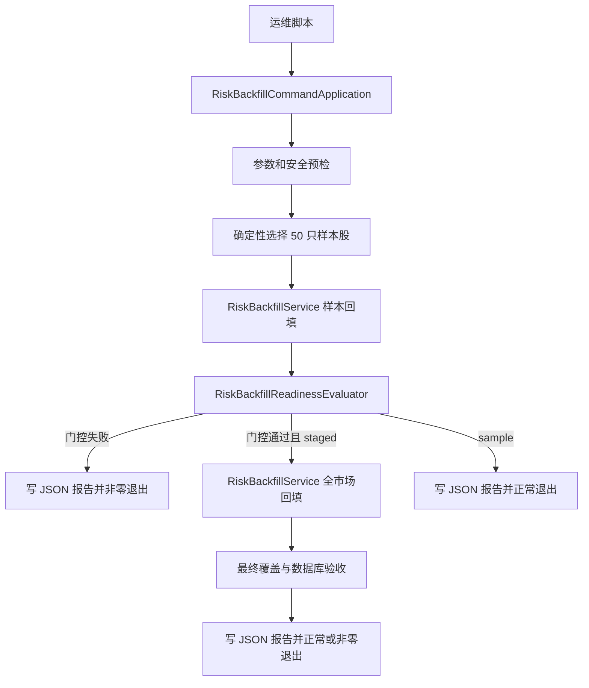

# 风险预警五年真实回填命令设计

## 1. 背景与目标

风险预警模块已经具备五年回填服务、Provider、评分引擎、影子闸门和断点表，但当前部署存在两个缺口：

1. `RiskBackfillService` 只有测试调用方，没有生产可执行入口；
2. 风险模块与回填开关默认关闭，本地数据库从未执行真实风险回填。

本期目标是提供一个默认关闭、必须显式确认、执行后退出的一次性内部命令。命令先对 50 只样本股执行五年回填和真实覆盖门控，门控通过后再扩展到全 A 股，并输出可审计的覆盖报告。最终使风险中心能够读取真实的三个周期风险快照。

风险分继续定位为综合指标分数，仅用于辅助决策，不代表暴跌概率，不构成投资建议，也不保证收益。

## 2. 范围

### 2.1 本期范围

- 新增内部一次性 CLI，不新增风险写 API；
- 支持 `sample`、`staged`、`full` 三种执行模式，默认使用 `staged`；
- `staged` 先执行 50 只样本股，再在覆盖门控通过后自动扩展到全 A 股；
- 回填结束日必须显式提供，评分窗口为最近五年，采集窗口额外包含六年滚动分位基线缓冲；
- 复用现有 Provider、`RiskBackfillService`、评分引擎、影子闸门和 `risk_ingestion_checkpoint`；
- 新增实际覆盖评估、JSON 报告、进程退出码和运维脚本；
- 首次真实执行前备份数据库，执行后验证三个周期、幂等性和影子模式；
- 数据不足时保存观测、事件、质量状态和断点，但不得制造正式风险等级或闸门结论。

### 2.2 非本期范围

- 浏览器或后台管理页面触发回填；
- 自动在普通应用启动时回填；
- 定时重复执行五年全量回填；
- 绕过 80% 覆盖门槛；
- 自动启用强制闸门；
- 实时行情、分钟行情或盘中风险计算；
- 用 `mock` 数据补齐真实数据缺口。

## 3. 方案选择

采用“一次性内部 CLI + 分阶段真实门控”方案。

未采用的方案：

- 后台写接口：操作方便，但违反本阶段不提供风险写 API 的约束，也扩大了误触发面；
- 普通启动 Runner 或定时全量任务：无需人工操作，但可能在开发或生产启动时意外发起长任务；
- 直接全市场执行：实现最少，但无法在数小时运行和大量写入前发现数据源覆盖缺口。

CLI 通过独立 `main` 类以非 Web 模式启动 Spring Context。只有同时满足风险模块开启、回填开启、命令开启和确认令牌正确四个条件时才执行。普通 `TrackerApplication` 的行为保持不变。

## 4. 总体架构



组件职责：

- `RiskBackfillCommandApplication`：以非 Web 模式启动、执行命令并关闭 Context；
- `RiskBackfillCommandRunner`：校验参数、选择执行阶段、协调回填和报告，不包含采集或评分算法；
- `RiskBackfillCommandProperties`：承载命令模式、结束日、样本数、确认令牌和报告路径；
- `RiskBackfillReadinessEvaluator`：根据真实落库数据计算能力覆盖、时序覆盖和正式快照覆盖；
- `RiskBackfillReadinessRepository`：只读查询风险观测、快照、断点和对象覆盖统计；
- `RiskBackfillReportWriter`：原子写入 JSON 报告；
- `RiskBackfillService`：继续作为唯一五年回填业务入口；
- `risk_ingestion_checkpoint`：继续作为 Provider、数据集和对象分块的断点来源。

## 5. 命令契约

新增配置前缀：

```yaml
stock-ai-rule:
  risk-warning:
    backfill-command:
      enabled: false
      mode: staged
      end-date:
      sample-size: 50
      symbols: []
      confirmation:
      report-directory: target/risk-backfill/reports
```

执行时必须同时提供：

```text
stock-ai-rule.risk-warning.enabled=true
stock-ai-rule.risk-warning.backfill-enabled=true
stock-ai-rule.risk-warning.backfill-command.enabled=true
stock-ai-rule.risk-warning.backfill-command.confirmation=BACKFILL_5Y
stock-ai-rule.risk-warning.backfill-command.end-date=YYYY-MM-DD
spring.main.web-application-type=none
```

模式语义：

- `sample`：仅执行样本回填并输出报告；
- `staged`：样本门控通过后自动执行全市场，默认模式；
- `full`：直接执行全市场，只允许在已经存在同一模型、同一结束日且通过门控的样本报告时使用。

`symbols` 非空时只允许用于 `sample`，便于复现特定对象；`staged` 的全量阶段始终使用数据库中的全部正常上市 A 股。样本未显式指定时，从标准化后的活跃 A 股代码按固定步长确定性抽取，保证重复运行选择相同且覆盖整个代码序列，而不是只取代码最小的 50 只。

运维脚本负责组合 Maven 主类和参数，但不保存数据库密码、Token 或确认令牌。敏感配置继续由环境变量提供。

## 6. 分阶段数据流

### 6.1 安全预检

命令开始前依次校验：

1. 四个显式开关和确认令牌；
2. Flyway 当前版本至少为 2；
3. 结束日存在于本地 A 股交易日历且为开市日；
4. 活跃 A 股股票池非空；
5. AKTools 地址已配置且可连接；
6. 报告目录可写；
7. `enforced` 约束仍为影子模式；
8. 模型版本非空且采集分块大小在 1 到 500 之间。

任一预检失败时不调用 Provider、不写风险业务表，输出失败报告并非零退出。

### 6.2 样本阶段

样本阶段调用现有 `RiskBackfillService.runFiveYearBackfill`。结束日为命令参数，评分开始日为结束日前五年，采集开始日为评分开始日前六年。Provider 按现有 200 只分块策略采集：

- A 股对象与申万一级行业归属；
- 市场和个股行情、估值、宽度及跨市场传导；
- 融资、ETF/资金流、业绩预告、公告、解禁及减持。

成功查询但无事件保存为 `valid_zero`；数据源失败保存为 `unavailable`，不得用零值替代。

### 6.3 样本扩全市场门控

样本完成后必须同时满足以下条件才允许扩全市场：

- `RiskWorkflowRunSummary.unavailableDatasetCount == 0`；
- 26 个指标子项按目录权重计算的实际可用覆盖率至少为 80%；
- V、C、A 三个维度分别达到 60%，并且 T 或 S 至少一个维度达到 60%；
- 核心行情类观测最早日期不晚于评分窗口开始日，结束日期覆盖命令结束日；
- 三个周期均存在市场样本快照；
- 正式快照必须满足完整度至少 80%，不完整快照只能作为审计数据；
- 所有 `available_at >= observed_at`；
- 所有闸门结果 `enforced=false`。

覆盖率只统计 `available` 和 `valid_zero`。`stale`、`unavailable`、缺失值和未来才可用的数据不计入分子。能力目录中宣称支持但本次没有真实数据的指标也不计入实际覆盖率。

### 6.4 全市场阶段

门控通过后使用空 `symbols` 调用现有全市场规划器，按 200 只分块执行。已完成分块通过幂等键和 `risk_ingestion_checkpoint` 复用；失败重跑不得重复插入快照、证据或闸门结果。

单个数据集或分块失败时：

- 保存已成功的数据与断点；
- 记录失败 Provider、数据集、范围和错误；
- 不把失败断点标记为成功；
- 停止本次全市场扩展并非零退出；
- 下次使用相同结束日、模型版本和模式重跑时从断点恢复。

## 7. 覆盖报告

每次命令生成一份 UTF-8 JSON 报告，文件名包含开始时间、模式和结束日。报告先写临时文件，再原子移动为最终文件，避免进程中断留下完整外观的半份报告。

报告至少包含：

- 运行编号、模式、模型版本、开始和结束时间、退出状态；
- 回填结束日、评分窗口和采集窗口；
- 样本代码、全市场股票数和分块数；
- 各 Provider/数据集成功、失败、不可用与断点数量；
- 观测、事件、快照、证据、闸门和断点写入数量；
- 26 个指标子项实际状态及加权覆盖率；
- 五个维度覆盖率、必备证据门控结果；
- 各表最早和最晚交易日；
- 三个周期的快照数、正式快照数和完整度分布；
- 未通过门控的明确原因和失败分块；
- 影子闸门 `enforced=false` 验证结果。

报告不得包含数据库密码、Token、完整外部响应或个人信息。

## 8. 退出码与错误处理

- `0`：所选模式完成且对应验收通过；
- `2`：参数、确认令牌或配置错误；
- `3`：数据库、Flyway、交易日历或股票池预检失败；
- `4`：样本回填失败；
- `5`：样本覆盖门控未通过；
- `6`：全市场回填失败，可从断点续跑；
- `7`：最终数据验收失败；
- `8`：报告写入失败。

异常必须保留原始根因并归一为上述阶段退出码。进程无论成功或失败都关闭 Spring Context；普通 Web 应用不加载命令 Runner。

## 9. 测试策略

### 9.1 单元测试

- 配置默认关闭、确认令牌、模式组合和参数边界；
- 确定性样本选择与股票数量不足场景；
- `sample/staged/full` 状态机；
- 覆盖率只统计真实可用证据；
- 80% 总覆盖、60% 单维度和必备证据门控；
- 日期覆盖、三个周期、正式快照和影子闸门门控；
- 各失败阶段退出码；
- JSON 报告内容、脱敏和原子写入。

### 9.2 集成测试

- 使用固定 Provider 响应验证样本通过后扩全市场；
- 样本失败时证明全市场 Provider 未被调用；
- MySQL 8 验证幂等键、断点续跑、JSON 字段和 `enforced=false`；
- 同一结束日重复执行后行数不增加；
- `available_at` 防未来函数；
- 数据不足时快照存在但等级、阶段和置信度为空；
- 普通 `TrackerApplication` 启动不执行回填命令。

### 9.3 真实执行验收

1. 备份目标数据库并记录 SHA-256；
2. 以 `sample` 或 `staged` 执行样本阶段；
3. 检查报告和 80% 门控；
4. 门控通过后执行或继续全市场阶段；
5. 重复执行确认断点和幂等；
6. 查询三个周期总览均返回 200；
7. 风险中心展示真实交易日、市场快照和证据；
8. 全量执行后运行后端测试、前端检查和数据库契约查询。

## 10. 运维与安全约束

- 普通配置继续保持 `enabled=false` 和 `backfill-enabled=false`；
- 命令入口默认关闭，确认令牌不写入配置文件；
- 首次样本和全市场执行前都必须存在可恢复备份；
- 不并发运行两个相同模型版本和结束日的回填进程；
- 不在运行中修改迁移脚本、模型版本、采集分块或数据源地址；
- 失败后先查看 JSON 报告与 checkpoint，再使用相同参数续跑；
- 不手工伪造 `flyway_schema_history`、风险快照或覆盖率；
- 覆盖不足时风险中心可以展示数据不足，但不得展示正式风险结论。

## 11. 完成标准

本功能只有同时满足以下条件才算完成：

- 存在可运行且默认关闭的一次性内部 CLI；
- 样本预检能够阻止覆盖不足的全市场回填；
- 全市场回填支持断点续跑和幂等重跑；
- JSON 报告能解释每个门控结果；
- 本地数据库实际存在五年评分窗口数据，而不只是测试夹具；
- 三个风险周期均能从只读 API 和风险中心查询；
- 风险等级和闸门只在原有完整度规则满足时产生；
- 影子闸门始终 `enforced=false`；
- 自动化测试与真实执行验收均通过。
