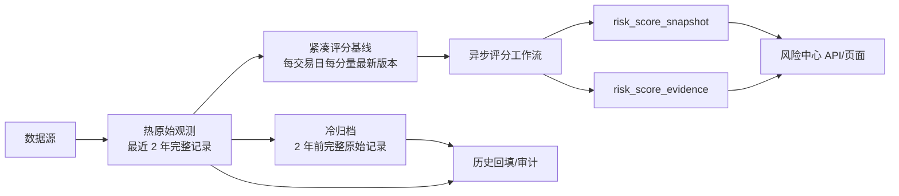

# 风险中心评分读模型与冷热分层设计

## 背景

风险中心当前虽然已经持久化 `risk_score_snapshot` 与 `risk_score_evidence`，但查询层在加载总览、对象列表和详情时，仍会调用暂定证据提供器扫描 `risk_indicator_observation` 的多年历史。页面一次首屏会并发加载市场、行业、股票和详情，导致同一批原始历史被重复读取；当原始表达到数百万行、实例缓冲池较小时，请求容易超过前端超时时间。

现有生产数据约 511 万行，最早日期为 2015 年，最近两年约占 22%，两年前数据约占 78%。这些长期数据对五年分位、历史回填和审计仍有价值，但不应处于风险中心的同步查询链路。

## 目标

1. 风险中心只查询已经落库的评分快照和评分证据，不再同步扫描原始观测表。
2. 日常评分可选择读取无大 JSON、无多版本膨胀的紧凑基线表。
3. 原始观测表只保留最近两年热数据，较早完整记录可迁入冷归档表。
4. 历史回填和审计仍可显式读取热表与冷表，保留修订和时点语义。
5. 数据分层通过可回滚的开关分阶段启用；数据库迁移不得自动搬迁或删除现有生产数据。

风险评分继续作为辅助决策信息，不代表事件发生概率，不构成投资建议。

## 总体架构

### 评分读模型

`risk_score_snapshot` 是页面的评分事实表，`risk_score_evidence` 是页面的解释证据表。风险中心的总览、列表和详情只允许读取这两张表以及对象暴露关系；查询层不得调用原始观测 Mapper。

当最新一次评分证据不足或失败时，页面展示已经持久化的 `provisional`、`insufficient`、`stale` 或 `unavailable` 状态。查询请求不临时重算，不因缺失结果回退到多年原始数据扫描。若需要新的暂定结果，应由同步/评分任务异步计算并落库。

### 紧凑基线表

新增 `risk_indicator_baseline`，保留评分所需的稳定字段：

- 对象、周期、交易日、维度、指标和分量；
- 实际数值、单位、质量状态；
- 观测时间、可用时间和来源；
- 每个自然键只保留最新可用版本。

不保存 `payload_json` 和旧修订。日常最新日评分在数据初始化完成并启用开关后读取该表，避免扫描大 JSON 和同日多版本记录。

### 热表与冷归档

新增 `risk_indicator_observation_archive`，结构与原始观测表一致，用于保存两年前的完整记录。归档必须按小批次执行，并在同一事务内完成：

1. 将待归档记录压缩写入基线表；
2. 复制完整记录到冷表；
3. 校验目标记录完整；
4. 从热表删除同一批记录。

归档能力默认关闭，先创建表、回填和校验基线，再由运维显式启用。五年回填与审计启用分层读取后查询热表和冷表，不使用仅保留最新修订的紧凑基线。

## 查询与写入规则

### 风险中心查询

- 总览：`risk_score_snapshot` + 批量 `risk_score_evidence`。
- 对象列表：数据库分页读取评分快照，证据按当前页快照 ID 批量读取。
- 对象详情：读取指定对象的三个周期快照和对应证据。
- 趋势：仅读取评分快照，不加载原始观测。

### 采集写入

每条新观测继续幂等写入热原始表，并同步 upsert 到紧凑基线。双写在同一事务内完成：热表保留全部修订与 JSON，基线只保留自然键下最新的有效版本。

### 评分读取

- 默认保持现有原始表读取，确保升级兼容。
- 完成基线回填和校验后，启用 `tiered-read-enabled`：
  - 日常单日评分读取紧凑基线；
  - 多日历史回填读取热表与冷归档表。
- 若未完成基线初始化，不得启用开关。

## 前端加载策略

- 股票列表默认页大小从 100 降为 20，行业列表仍可一次加载全部一级行业。
- 总览、市场、行业和当前页股票继续独立容错；单个区域失败不清空其他可用区域。
- 详情只在确定首选对象后加载，趋势最多返回既有的 120 个交易日。

## 发布与回滚

发布分为三步：

1. 部署代码和建表迁移，风险中心立即切换到评分读模型；分层读取和自动归档保持关闭。
2. 按运维文档回填紧凑基线并核对覆盖范围、空值和抽样分数。
3. 启用分层读取，再小批次启用两年外归档；观察评分耗时和结果一致性后逐步放量。

回滚时关闭分层读取和归档开关即可恢复从热原始表评分；冷表不删除，已归档数据可按主键复制回热表。

## 验收标准

- 风险中心查询服务构造函数和调用链不再依赖 `ProvisionalRiskEvidenceProvider` 或 `RiskProvisionalObservationMapper`。
- 评分读模型相关单元测试全部通过，并验证不完整快照只使用已落库证据。
- V4 迁移包含紧凑基线、冷归档以及关键唯一键和查询索引。
- 新观测对热表和基线表双写幂等，较新修订覆盖基线，较旧修订不能回退基线。
- 分层读取开启后，日常评分读取基线，历史回填可读取热表与冷表。
- 股票首屏分页默认 20 条。
- 后端全量测试、前端风险中心测试和静态检查通过。

